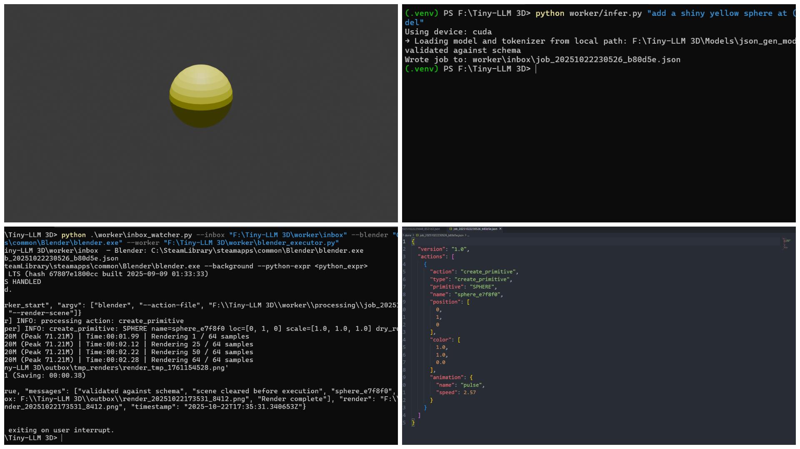
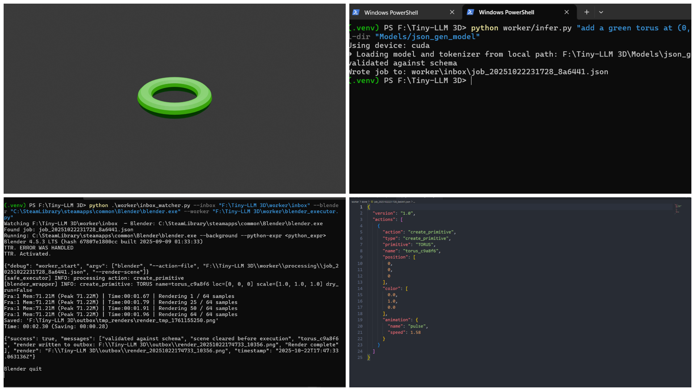
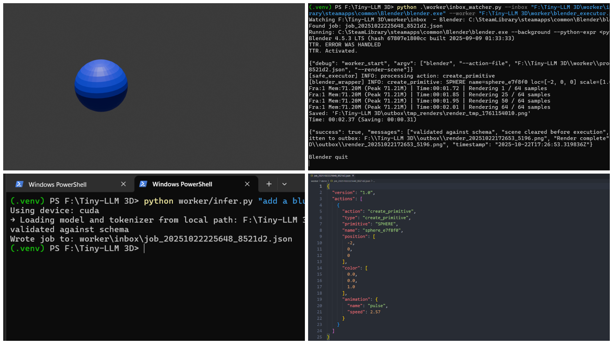

# 🧠 Tiny-LLM-3D  
A minimal AI-powered 3D scene generator for Blender — converts natural language prompts into 3D object renders.

---

## ✨ Features
- 🧩 Uses a fine-tuned LLM to parse text prompts → structured JSON actions  
- 🧱 Executes actions safely inside Blender  
- 🎨 Automatically renders cinematic images  
- 🧠 No cloud dependency — runs fully locally  

---

## 📁 Project Structure
```
Tiny-LLM-3D/
├── demo_prompt_to_render.py     # main script to run prompt → render
├── worker/
│   ├── infer.py                 # text → JSON inference logic
│   ├── blender_executor.py      # executes JSON inside Blender
│   ├── blender_wrapper.py       # bpy-based scene control
│   ├── inbox_watcher.py         # watches for new jobs
│   ├── action_schema.json       # JSON schema validation
├── Models/
│   └── json_gen_model/          # fine-tuned model folder (add README here)
├── outbox/                      # rendered output images
└── requirements.txt
```

---

## ⚙️ Setup

1. **Clone the repo**
   ```bash
   git clone https://github.com/Shaurya-34/Tiny-LLM-3D.git
   cd Tiny-LLM-3D
   ```

2. **Create & activate virtual environment**
   ```bash
   python -m venv .venv
   .venv\Scripts\activate
   ```

3. **Install dependencies**
   ```bash
   pip install -r requirements.txt
   ```

4. **Verify Blender is installed**
   ```bash
   blender --version
   ```

---

## 🧠 Model Setup

This project uses a **local fine-tuned model** to convert natural language prompts into structured JSON.  
The model is **not included** in this repository to keep it lightweight.

### 🪶 Option 1: Use your own fine-tuned model
Place your Hugging Face or fine-tuned model inside:
```
Tiny-LLM-3D/Models/json_gen_model/
```
Ensure it contains:
```
config.json
pytorch_model.bin
tokenizer.json
tokenizer_config.json
```

Then run:
```bash
python worker/infer.py "add a red cube at (0,0,0)" --model-dir "Models/json_gen_model"
```

### ⚙️ Option 2: Use rule-based fallback
If you don't have a model, Tiny-LLM-3D will **automatically switch** to a built-in rule-based mode that still generates valid JSON for simple prompts.

You’ll see:
```
Model load failed or not available; will use rule-based fallback.
```

That’s normal and safe — this fallback ensures the demo still runs fully offline.

---

## 🚀 Run the Demo

> 💡 **Tip:** Before running any `infer.py` commands, make sure the inbox watcher is active.  
Start it in a separate terminal:
```bash
python worker/inbox_watcher.py --blender "C:/Path/to/blender.exe" --inbox worker/inbox --worker worker/blender_executor.py
```

Generate action JSON:
```bash
python worker/infer.py "add a red cube at (0,0,0)" --model-dir "Models/json_gen_model"
```

Render it in Blender:
```bash
python demo_prompt_to_render.py
```

Outputs will appear in `outbox/`.

---

## 🖼️ Example Outputs

| Prompt | Render |
|--------|---------|
| “add a shiny yellow sphere” |  |
| “add a green torus at (1,2,0)” |  |
| “add a blue sphere at (-2,0,0)” |  |

---

## 📦 Requirements
```
torch
transformers
jsonschema
bpy
tqdm
```

---

## 🧱 Credits
Created by [Shaurya-34](https://github.com/Shaurya-34)  
Inspired by the goal of bridging LLMs with 3D creative workflows.
